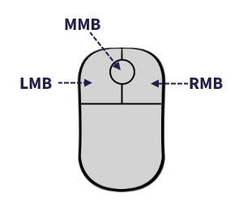

# Lynput Manual

[](https://love2d.org/wiki/Category:Versions)
[](LICENSE)


## Index
- [Requirements](#requirements)
- [Installation](#installation)
- [Usage](#usage)
  - [Basics](#basics)
  - [Lynput callbacks](#lynput-callbacks)
  - [Input states](#input-states)
    - [Button states](#buttons-states)
    - [Axis states](#axis-states)
  - [Keyboard](#keyboard)
  - [Mouse](#mouse)
  - [Gamepad](#gamepad)
  - [Configuring multiple inputs at once](#configuring-multiple-inputs-at-once)
  - [The "any" input](#the-any-input)
  - [I've bind my controls, what's next?](#ive-bind-my-controls-whats-next)
  - [Names that can't be used as an action](#names-that-cant-be-used-as-an-action)
- [All available functions](#all-available-functions)
- [License](#license)

## Requirements
Lynput requires LÖVE version <code>0.10.0</code> or later.

## Installation
Just download the <code>Lynput.lua</code> file. Place it anywhere you want inside your game folder, just be careful with the path when requiring the library. Also remember that this file name starts with a capital letter.

## Usage
### Basics
First you need to load the library:
```lua
Lynput = require("path.to.Lynput") -- Notice that the file starts with a capital letter
```
Then, you need to create a Lynput object:
```lua
control = Lynput()
```
Lynput objects need to be updated in order to work:
```lua
-- put this after all your game logic happens, for example at the bottom of love.update(dt)
Lynput.update_(dt) -- Notice the underscore
```
Once you don't need the object anymore, destroy it with:
```lua
control:remove()
```

### Lynput callbacks
To make Lynput able to check your computer input, it's necessary to set its callbacks. You can set them by yourself, or you can let Lynput do this job. Do it yourself if you need to override the LÖVE callbacks with more stuff aside from Lynput callbacks. 

Only set those that will be used for better performance.

#### Keyboard callbacks
To make Lynput load the keyboard callbacks:
```lua
Lynput.load_key_callbacks()
```
To load them by yourself, override this love functions as indicated:
```lua
function love.keypressed(key)
  -- your stuff
  Lynput.onkeypressed(key)
  -- your stuff
end

function love.keyreleased(key)
  -- your stuff
  Lynput.onkeyreleased(key)
  -- your stuff
end
```

#### Mouse callbacks
To make Lynput load the mouse callbacks:
```lua
Lynput.load_mouse_callbacks()
```
To load them by yourself, override this love functions as indicated:
```lua
function love.mousepressed(x, y, button, istouch)
  -- your stuff
  Lynput.onmousepressed(button)
  -- your stuff
end

function love.mousereleased(x, y, button, istouch)
  -- your stuff
  Lynput.onmousereleased(button)
  -- your stuff
end
```

#### Gamepad callbacks
To make Lynput load the gamepad callbacks:
```lua
Lynput.load_gamepad_callbacks()
```
To load them by yourself, override this love functions as indicated:
```lua
function love.gamepadpressed(joystick, button)
  -- your stuff
  Lynput.ongamepadpressed(joystick:getID(), button)
  -- your stuff
end

function love.gamepadreleased(joystick, button)
  -- your stuff
  Lynput.ongamepadreleased(joystick:getID(), button)
  -- your stuff
end

function love.joystickadded(joystick)
  -- your stuff
  Lynput.ongamepadadded(joystick)
  -- your stuff
end
```

### Input states
For now, there are two kinds of states for inputs: **button states** and **axis states**.

#### Button states
Button states indicates the state of a button :sweat_smile:, and those can be: <code>press</code>, <code>release</code>, <code>hold</code>
So if you want the player to move left when holding left arrow, you'd do:
```lua
playerControl:bind("moveLeft", "hold left")
```

#### Axis states
Axis states indicates the state of an axis :unamused:, and since its state is a number and it depends on how much you move your sticks or triggers, going from -1 to +1 in LÖVE (0 to +1 for triggers like G_LT or G_RT), there are infinite states :fearful:. 


But don't worry, we are not going to specify an specific state, but an interval, and we are going to multiply it by 100 because it's easier to read. So, if you want the player to move left when moving the left stick of a gamepad along the x axis, you'd do:
```lua
playerControl:bind("moveLeft", "-100:0 G_LEFTSTICK_X") -- It won't be -100:0, but -100:-30 because Lynput has a default dead zone of 30
```
To make the player move right:
```lua
playerControl:bind("moveRight", "0:100 G_LEFTSTICK_X") -- It won't be 0:100, but -100:-30 because Lynput has a default dead zone of 30
```

### Keyboard
To specify a key you just need to know [how LÖVE names that key](https://love2d.org/wiki/KeyConstant). Then if you want the player to jump by pressing <code>space</code>, you'd do:
```lua
playerControl:bind("jump", "press space")
```

### Mouse
To specify a mouse button you just need to know how Lynput names them (see image below), since LÖVE uses numbers and Lynput can't because they are for keyboard keys.



Then if you want the player to shoot by pressing <code>left click</code>, you'd do:
```lua
playerControl:bind("shoot", "press LMB")
```

### Gamepad
In order to use gamepads, we have to bind a Lynput object with a gamepad. You can do this by:

```lua
playerControl:attachGamepad("GPAD_1") -- This will be the gamepad number 1, for the second one use 2, third 3, and so on
```

Once it's done, you can start to configure your controls.

To specify a gamepad button or axis you just need to know how Lynput names them (see image below), since LÖVE uses names that Lynput can't because they are for keyboard keys.


Then if you want the player to jump by pressing <code>A</code> and move up with the <code>left stick Y axis</code>, you'd do:
```lua
playerControl:bind("jump", "press G_A")
playerControl:bind("moveUp", "-100:0 G_LEFTSTICK_Y")
```

### Configuring multiple inputs at once
If you want the player to move down using <code>down arrow</code>, <code>key s</code>, <code>dpad down</code> and <code>left stick Y axis</code>, you don't need to make four bindings. You can just do:
```lua
playerControl:bind(
  "moveDown",
  {
    "hold down",
    "hold s",
    "hold G_DPAD_DOWN",
    "0:100 G_LEFTSTICK_Y"
  }
)
```

### The "any" input
Imagine you are making a game that starts with a intro with some logos, clips and other stuff, and then you want a screen title saying "Press any button to start". How would you do that with Lynput? It's really easy, you just need to bind all keys to an action called any :alien:. I'm just joking lol, for that kind of purposes there is an input called <code>any</code>. To make that screen title control you'd do:

```lua
control:bind("start", "press any")
```

### I've bind my controls, what's next?
Now, you need to check if your controls have been triggered. You can do this in your <code>update</code> functions as follows:

```lua
if playerControl.moveLeft  then moveLeft()     end
if playerControl.moveRight then moveRight()    end
if playerControl.moveUp    then moveUp()       end
if playerControl.moveDown  then moveDown()     end
if playerControl.jump      then jump()         end
if playerControl.shoot     then shoot()        end
if control.start           then goToMainMenu() end
```

### Names that can't be used as an action
What's an action? Well, for Lynput an action is the name you give to the thing you want the player to do. If you want your player to pause the game by pressing <code>p</code> you'd do: 

```lua
playerControls:bind("pause", "press p")
```

In the case above, <code>pause</code>, the first argument, is the action. There is no problem if you call your action "pause", but you cannot use [words or characters reserved by Lua](https://www.lua.org/manual/5.1/manual.html#2.1) or Lynput (see table below).

|     Reserved by Lynput     	|
|:--------------------------:	|
|   <code>inputsSet</code>   	|
|      <code>gpad</code>     	|
|  <code>gpadDeadZone</code> 	|
|       <code>id</code>      	|
|     <code>remove</code>    	|
| <code>attachGamepad</code> 	|
|      <code>bind</code>     	|
|     <code>unbind</code>    	|
|   <code>unbindAll</code>   	|
|  <code>removeAction</code> 	|
|     <code>update</code>    	|

## All available functions
| Function                                    	| Description                                                                   	| Example                                            	|
|----------------------------------------------	|--------------------------------------------------------------------------------	|-----------------------------------------------------	|
| <code>Lynput.load_key_callbacks()</code>     	| Sets all keyboard callbacks                                       	| <code>Lynput.load_key_callbacks()</code>            	|
| <code>Lynput.load_mouse_callbacks()</code>   	| Sets all mouse callbacks                                          	| <code>Lynput.load_mouse_callbacks()</code>          	|
| <code>Lynput.load_gamepad_callbacks()</code> 	| Sets all gamepad callbacks                                        	| <code>Lynput.load_gamepad_callbacks()</code>        	|
| <code>Lynput.update_(dt)</code>              	| Update all Lynput objects                                         	| <code>Lynput.update_(dt)</code>                     	|
| <code>Lynput:remove()</code>                 	| Remove the calling Lynput object                                  	| <code>controls:remove()</code>                      	|
| <code>Lynput:attachGamepad(gamepad)</code>   	| Attachs a gamepad to the calling Lynput object                    	| <code>controls:attachGamepad("GPAD_1")</code>       	|
| <code>Lynput:bind(action, commands)</code>   	| Binds commands to an action for the calling Lynput object         	| <code>controls:bind("jump", "press space")</code>   	|
| <code>Lynput:unbind(action, commands)</code> 	| Unbinds commands from an action for the calling Lynput object     	| <code>controls:unbind("jump", "press space")</code> 	|
| <code>Lynput:unbindAll(action)</code>        	| Unbinds all commands from an action for the calling Lynput object 	| <code>controls:unbindAll("jump")</code>             	|
| <code>Lynput:removeAction(action)</code>     	| Removes an action of the calling Lynput object                    	| <code>controls:removeAction("jump")</code>          	|

## License
This software is licensed under the MIT license. Check the details by clicking [here](LICENSE).
