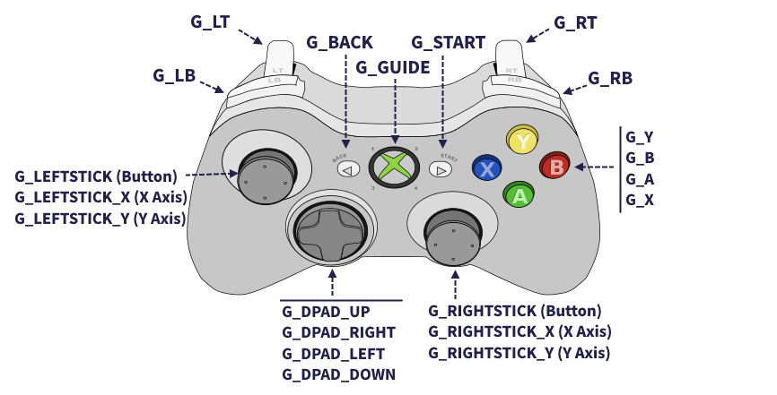

# Lynput (in development) :construction::construction:
[](https://love2d.org/wiki/11.1)

**Lynput** is an input library for LÖVE that  makes input handling very intuitive 💙.

## Devices supported
- [X] Keyboard
- [x] Mouse pressed, released and holding events
- [X] Gamepad buttons
- [ ] Mouse position and movement
- [ ] Gamepad joysticks and trigers
- [ ] Touch screen

## Features
- [x] Multiple independent input objects
- [x] Easy and intuitive input binding and unbindig
- [ ] Saving and loading input configuration files
- [ ] ...

## Lynput gamepad map
Analog inputs are not implemented yet, that's why they do not appear in the map that follows.



## Lynput?
```lua
if not creativity then
    name = Lydzje + input
    print(name)
end -- if not creativity
```
> Output:
>
> Lynput
